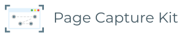

# 

An experimental tool to help with navigating sites in order to capture a deeply nested page as a screenshot.
This tool will allow you to capture pages that are under authentication. Page Capture Kit includes simplified logic to pre-fill forms with provided credentials.

Example:

```shell
page-capture-kit --scripts=/my/path/to/folder --output=/my/path/to/screenshots
```

## Table of Contents

<!-- START doctoc generated TOC please keep comment here to allow auto update -->
<!-- DON'T EDIT THIS SECTION, INSTEAD RE-RUN doctoc TO UPDATE -->


- [Installation](#installation)
- [Motivation](#motivation)
- [Scripts](#scripts)
  - [Payload](#payload)
  - [Context](#context)
    - [`capture(filename, pattern)`](#capturefilename-pattern)
    - [`click(selector, navigation)`](#clickselector-navigation)
    - [`end()`](#end)
    - [`hover(selector)`](#hoverselector)
    - [`login(username, password)`](#loginusername-password)
    - [`next()`](#next)
    - [`open(url)`](#openurl)
    - [`series(action1, action2, ..., actionX)`](#seriesaction1-action2--actionx)
    - [`wait(condition)`](#waitcondition)

<!-- END doctoc generated TOC please keep comment here to allow auto update -->

## Installation

Install from the NPM: `npm install -g page-capture-kit`

Or checkout this GitHub repository and link the package: `npm link`

## Motivation

What if you need some data for your needs but service does not provide API to get it. 
What if every month you need invoice-like information from video services you are using.
The motivation behind the tool to capture deeply nested pages with the information you can get in a different way other than navigating around the website and capturing a screenshot.

This tool does not include any fancy parsing logic or solutions to bypass CAPTCHA and other systems for the protection against unauthorized or bot access.
But it can help with simple cases like to grab the last payment for Netflix or other services.

## Scripts

Script is a concept for the set of instructions for Page Capture Kit to execute on.
You write scripts in JavaScript and put them in some directory.
Page Capture Kit will "play" them for you with the likely screenshot as output in the end.

The main helping tool in the script writing is `Context`. 
`Context` provides the set of predefined methods to help with actions like `click` items on the page, or visiting web pages.

Example of very basic script with Google (`basic-google.script.js`).
Store this script somewhere and ask `Page Capture Kit` to play it:

```javascript
class GoogleExample {
    visit(payload, context) {
        return context.series(
            context.open('https://www.google.com'),
            context.capture('Google'),
            context.end()
        );
    }
}

module.exports = GoogleExample;
```

```shell
# It will output PNG with Google page in the current directory where you run Page Capture Kit
page-capture-kit --scripts=/path/to/directory/with/basic-google --output=./ 
```

Technically scripts are JavaScript classes with a single method `visit(payload, context)`, where `payload` - is potentially useful data, and `context` to help with actions for Page Capture Kit.

### Payload

Simple `Object` with following properties:

- `step <Number>` - every time when `visit` is invoked `step` will increase. Counting starts from `0`.

### Context

Abstraction around possible actions with the current web page.
There are three actions that help with orchestration around script execution: `series()`, `next()`, and `end()`.
You should wrap all actions with `series()`, if you want to go to the next step, use `next()`, and do not forget to use `end()` in the very end of the script.

#### `capture(filename, pattern)`

Parameters:

- `filename <String>` - name of the screenshot
- `pattern <String>` - the format pattern for the date part in the filename. It's powered by Date Functions, follow documentation for the [format](https://date-fns.org/v2.14.0/docs/format). Default value is `yyyy-MM-dd--HH-mm-ss`.

#### `click(selector, navigation)`

Parameters:

- `selector <String>` - CSS selector or XPath for the element on the page
- `navigation <Boolean>` - checks if it's necessary to wait for the navigation on the page. Useful when links are clicked and browser will load a new page. Default: `true`.

#### `end()`

Use it in the end of all actions for the script.
This action will terminate browse session.

#### `hover(selector)`

Parameters:

- `selector <String>` - CSS selector or XPath for the element on the page

#### `login(username, password)`

Do not store usernames and passwords in the scripts.
Utilize environment variables. Please check [examples](./example/) directory for some ideas around credentials.

Parameters:

- `username <String>` - username credential for the service
- `password <String>` - password credentials for the service

#### `next()`

Asks Page Capture Kit to go to the next step. 
As a result `visit()` method in the script will be invoked with incremented `step` value.
This technique could help to manage long and complex scripts.

#### `open(url)`

Parameters:

- `url <String>` - fully qualified URL to visit.

#### `series(action1, action2, ..., actionX)`

Groups context actions in the series of actions to execute in the context of the page.

#### `wait(condition)`

Parameters:

- `condition <String>` - it could be `selector` to wait for some element to appear on the page or it could be a timeout in milliseconds.
